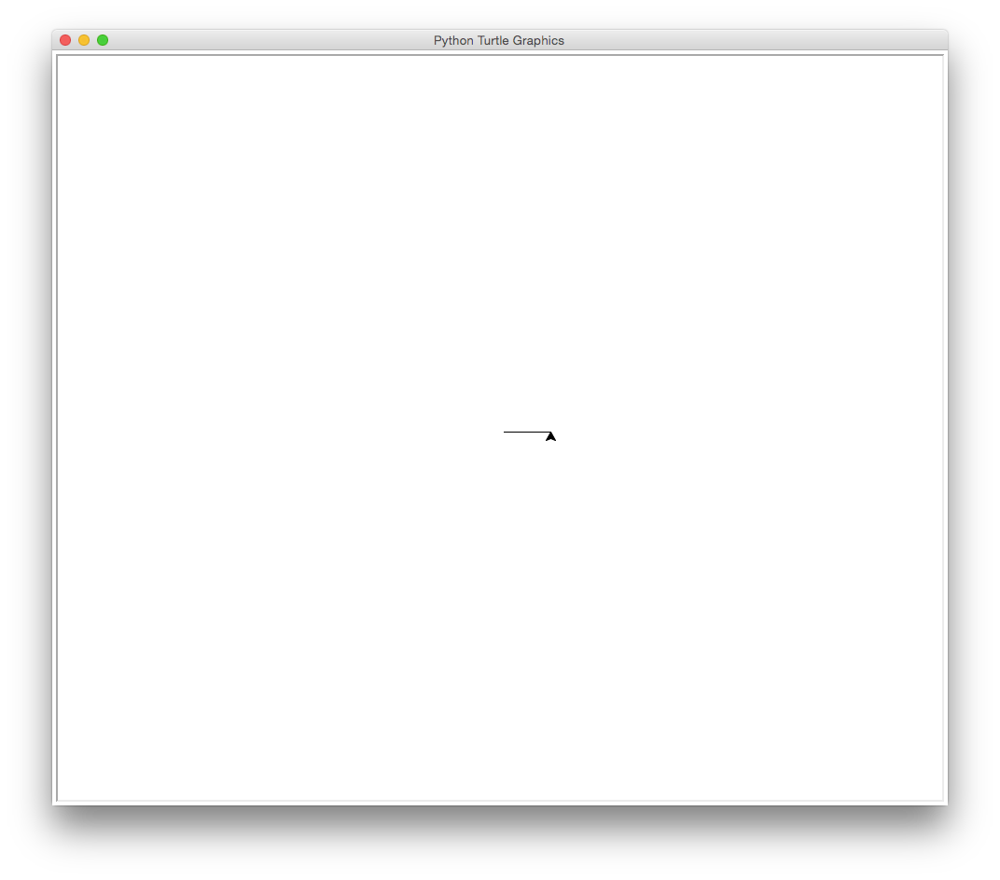
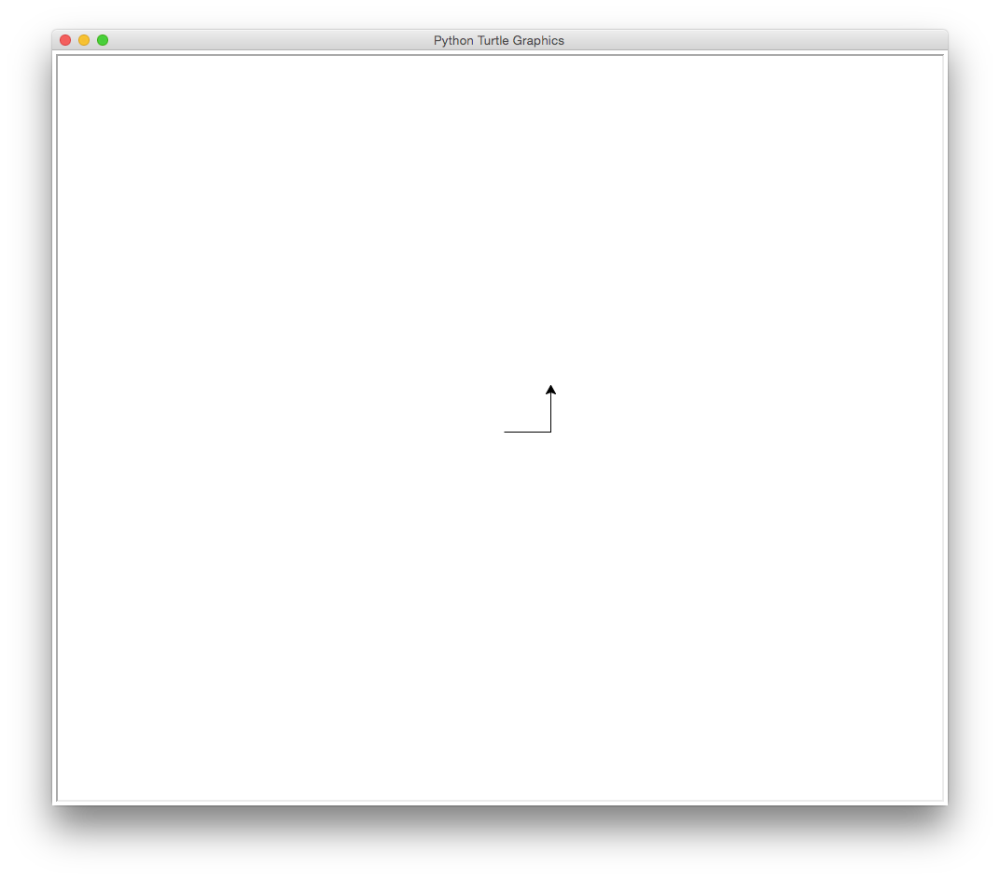
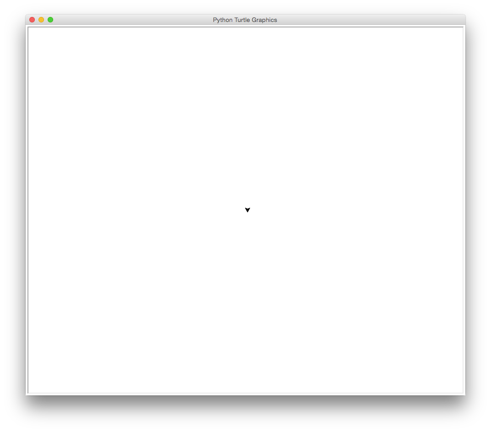
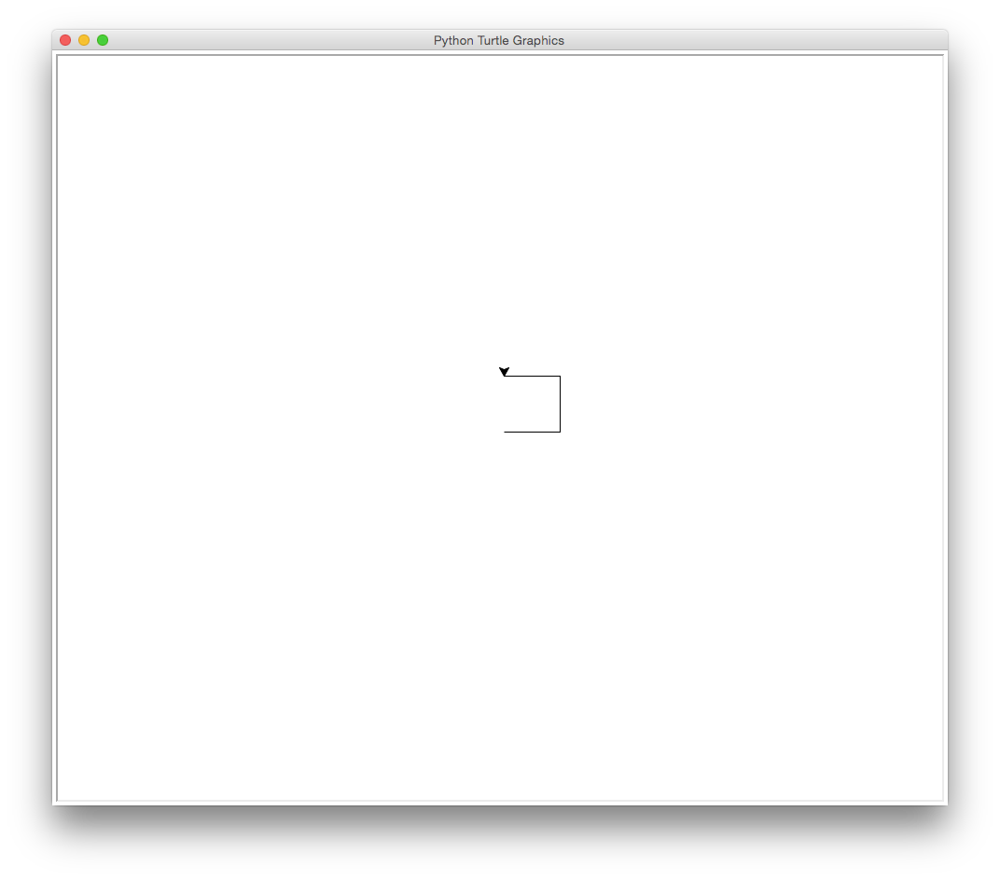

> ## Learning Objectives
>
> *   Explain what a library is, and what libraries are used for.
> *   Load a Python library and use the things it contains.
> *   Assign values to variables.
> *   Draw lines using the turtle graphics library.
> *   Create `for` loops over literal lists.
> *   Create `for` loops over lists generated by `range`.
> *   Use `for` loops to draw simple polygons.

Let's start by running Python interactively in a command shell:

~~~ {.input}
$ python
~~~
~~~ {.output}
Python 2.7.8 |Anaconda 2.1.0 (x86_64)| (default, Aug 21 2014, 15:21:46) 
[GCC 4.2.1 (Apple Inc. build 5577)] on darwin
Type "help", "copyright", "credits" or "license" for more information.
Anaconda is brought to you by Continuum Analytics.
Please check out: http://continuum.io/thanks and https://binstar.org
>>> 
~~~

The `>>>` prompt is Python's equivalent of
the `$` prompt that the shell uses,
and shows that Python is ready to accept commands.
To make sure everything's working,
let's do some simple arithmetic:

~~~ {.input}
>>> print 1 + 2
~~~
~~~ {.output}
3
~~~

`print` is a command,
just like `cat` and `cd` are commands in the shell.
The difference is that `print` is being interpreted by Python:

FIXME: figure showing Python on top of the shell

While a lot of powerful commands are built into Python,
even more live in the **libraries** those commands are used to build.
In order to use a library,
we need to **import** it like this:

~~~ {.input}
>>> import turtle
~~~

This command does not produce any output:
since everything worked,
it doesn't need our attention.
We can check that the library has been loaded
by trying to print it:

~~~ {.input}
>>> print turtle
~~~
~~~ {.output}
<module 'turtle' from '/Users/gvwilson/anaconda/lib/python2.7/lib-tk/turtle.pyc'>
~~~

That message doesn't mean anything to us yet,
but it does confirm that the library has been loaded.
If it hadn't been,
or if we mis-typed the name,
we would get an error message:

~~~ {.input}
>>> print hamster
~~~
~~~ {.error}
Traceback (most recent call last):
  File "<stdin>", line 1, in <module>
NameError: name 'hamster' is not defined
~~~

Now that the library has been loaded,
we can tell Python to use it like this:

~~~ {.input}
>>> turtle.forward(50)
~~~

If everything is working,
a new window should open to display a short black arrow pointing right:

The arrowhead is a **turtle** ---
a simple drawing cursor that we can move with Python commands.
The line is 50 pixels long
and shows how the turtle has recently moved.

> ## Turtles {.callout}
>
> FIXME: explain origins of turtle graphics

The expression `turtle.forward` is an example of **dotted notation**.
The word on the left of the dot identifies the thing that's doing the action;
the word on the right is something it knows how to do.
Since we want to tell the turtle how far to go when we ask it to move forward,
we have to give `turtle.forward` a number
(in this case, 50).

Turtles know how to do many other things as well.
Try this:

~~~ {.input}
>>> turtle.left(90)
~~~

The picture hasn't changed,
but the turtle is now pointing straight up,
i.e.,
90 degrees counter-clockwise from its previous heading.
If we tell the turtle to move forward again,
it draws a line in that direction:

~~~ {.input}
>>> turtle.forward(50)
~~~

If we tell the turtle to turn left, go forward, turn left, and go forward again,
the result is a square:

~~~ {.input}
>>> turtle.left(90)
>>> turtle.forward(50)
>>> turtle.left(90)
>>> turtle.forward(50)
~~~

We can erase the drawing by asking the turtle to clear the screen:

~~~ {.input}
>>> turtle.clear()
~~~

If you look carefully,
you'll see that this leaves the turtle pointing south.
If we want to clear the screen *and* put the turtle back in the starting position,
we need to ask it to reset itself:

~~~ {.input}
>>> turtle.reset()
~~~

Notice that both `turtle.clear` and `turtle.reset` have empty parentheses
after their names.
We use parentheses whenever we are asking a turtle (or anything else)
to do an action ---
in technical terms,
to execute a **method**.
If we leave off the parentheses,
Python just shows us that the method we're talking about exists:

~~~ {.input}
>>> turtle.forward
<function forward at 0x1007cb398>
~~~
~~~ {.output}
<function forward at 0x1007cb398>
~~~

Suppose we want to draw our square again,
but make it larger.
We could use up-arrow to cycle through previous commands,
just as we do in the shell,
but entering them one by one would be tedious.
Instead,
let's get the computer to repeat things for us.

The first step looks like this:

~~~ {.input}
>>> for number in [1, 2, 3]:
...     print 9
... 
~~~
~~~ {.output}
9
9
9
~~~

The first line starts a `for` loop.
It tells Python that we want to repeat a command
once for each value in a list.
The list is written as `[1, 2, 3]`,
and the command to be repeated --- `print 9` ---
is indented under the first line.

The word `number` is a **variable**.
Each time Python executes the loop,
it **assigns** the next value from the list to the variable.
We can then use the variable inside the loop like this:

~~~ {.input}
>>> for number in [1, 2, 3]:
...     print number
... 
~~~
~~~ {.output}
1
2
3
~~~

There is nothing special about the name `number` ---
we could equally well write the loop like this:

~~~ {.input}
>>> for thing in [1, 2, 3]:
...     print thing
... 
~~~
~~~ {.output}
1
2
3
~~~

We can also put multiple commmands, or **statements**, in the loop:

~~~ {.input}
>>> for number in [1, 2, 3]:
...     print number
...     print number * number
... 
~~~
~~~ {.output}
1
1
2
4
3
9
~~~

We now have everything we need to draw a square:

~~~ {.input}
>>> for number in [1, 2, 3, 4]:
...     turtle.forward(60)
...     turtle.left(90)
... 
~~~

This is much better than typing "forward", "left", "forward", "left"
over and over again
for two reasons:

1.  It's easier to see the intent:
    the turtle is moving forward and turning left four times.

2.  It's easier to check its consistency:
    the key numbers 60 (the distance) and 90 (the angle)
    only appear once.

Note that the indentation is really important.
If we write this as:

~~~ {.input}
>>> for number in [1, 2, 3, 4]:
...     turtle.forward(60)
... 
>>> turtle.left(90)
~~~

we're telling the turtle to forward forward 60 pixels four times,
and then turn left once.

> ## FIXME {.challenge}
>
> Explain why we need the blank line.

This loop could still be improved, though.
To see why,
clear the screen with `turtle.reset()`:

~~~ {.input}
>>> turtle.reset()
~~~

and then run this:

~~~ {.input}
>>> for number in [1, 2, 4]:
...     turtle.forward(60)
...     turtle.left(90)
... 
~~~

The output is:

which is clearly not a square.
It only takes a moment to realize that
we mis-typed the list:
it is `[1, 2, 4]` with the 3 missing.

The problem is simple enough to spot in this case,
but would be harder if we were drawing a 20-sided polygon.
Luckily,
Python has a built-in **function** to help us:

~~~ {.input}
>>> print range(4)
~~~
~~~ {.output}
[0, 1, 2, 3]
~~~
~~~ {.input}
>>> print range(10)
~~~
~~~ {.output}
[0, 1, 2, 3, 4, 5, 6, 7, 8, 9]
~~~

As you can probably guess,
`range(N)` creates a list of N numbers starting at 0.
We can use this to draw our square:

~~~ {.input}
>>> turtle.reset()
~~~

~~~ {.input}
>>> for side in range(4):
...     turtle.forward(60)
...     turtle.left(90)
... 
~~~

Using `range` this way makes the intent of our code even clearer,
as does calling the **loop variable** `side` instead of `number`.
We can now see that
if we want to change the number of sides,
we change the **parameter** passed to `range`.
If we want to change the size of the polygon,
we change the parameter to `turtle.forward`,
and if we want to change the turning angle,
we change the parameter to `left`.
For example,
to create a hexagon,
we do this:

~~~ {.input}
>>> turtle.reset()
~~~

~~~ {.input}
>>> for side in range(6):
...     turtle.forward(50)
...     turtle.left(60)
... 
~~~

These three lines now embody one of the core principles of good program design:
every fact appears exactly once.
If we want to change the number of sides,
we change the parameter to `range`;
if we want to change the size,
we change the parameter to `turtle.forward`,
and if we want a different turning angle,
we give `turtle.left` a different value.
Equally,
we can now read the behavior directly from the code:
"draw 6 lines, each 50 pixels long, at 60 degree angles to each other".

But we're still not done,
because we still need to type in three lines each time we want to draw a polygon.
What we'd really like to do is type:

~~~ {.input}
>>> polygon(6, 50, 60)
~~~

and have Python figure out the rest.
How we do that is the subject of the next lesson.

> ## FIXME {.challenge}
>
> Add challenges.
